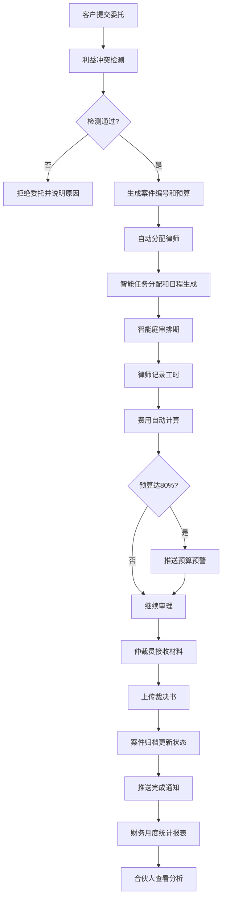

## 1. 产品概述

本系统是为大型跨国律师事务所设计的综合案件管理与智能仲裁平台，实现案件全生命周期的数字化管理。系统支持客户、律师、合伙人、仲裁员和财务五种角色的协同工作，通过智能算法优化案件分配、排期、预算管控等核心流程，提升律所运营效率和服务质量。

## 2. 核心功能

### 2.1 用户角色

| 角色 | 登录方式 | 核心权限 |
|------|----------|----------|
| 客户 | 账号密码登录 | 提交案件委托、查看案件进展、查看账单明细、申请电子发票 |
| 律师 | 账号密码登录 | 创建案件、记录工时、管理任务日程、参与庭审、上传文件 |
| 合伙人 | 账号密码登录 | 查看案件统计报表、监控进度/收费率/胜诉率、审批重大事项 |
| 仲裁员 | 账号密码登录 | 接收案件材料、上传裁决书、管理仲裁日程 |
| 财务 | 账号密码登录 | 统计收费总额、管理回款、生成财务报表、处理发票申请 |

### 2.2 功能模块

1. **登录认证页**：角色选择登录、权限验证
2. **客户门户**：案件委托提交、案件进展查看、账单管理、发票申请
3. **律师工作台**：案件管理、任务分配、日程管理、工时记录、庭审排期
4. **合伙人仪表盘**：数据可视化报表、案件进度监控、业绩对比分析
5. **仲裁员平台**：案件材料接收、裁决书上传、仲裁状态管理
6. **财务系统**：费用核算、回款管理、月度报表、发票管理
7. **消息中心**：实时通知推送、消息提醒、凭证下载
8. **系统管理**：利益冲突检测、案件编号生成、预算管理

### 2.3 页面详情

| 页面名称 | 模块名称 | 功能描述 |
|----------|----------|----------|
| 登录页 | 角色选择登录 | 五种角色切换登录、表单验证、记住密码 |
| 客户首页 | 案件概览 | 我的案件列表、案件状态卡片、最新消息通知 |
| 客户-案件委托 | 委托表单 | 案件信息填写、附件上传、利益冲突自动检测 |
| 客户-案件详情 | 进展追踪 | 时间线展示、案件文件、律师信息、状态更新 |
| 客户-账单中心 | 账单管理 | 账单列表、费用明细、支付记录、发票申请 |
| 律师工作台 | 待办事项 | 今日任务、即将庭审、工时提醒、预算预警 |
| 律师-案件管理 | 案件列表 | 案件筛选、创建案件、案件详情入口 |
| 律师-任务管理 | 智能分配 | 自动任务分配、日程生成、冲突检测与替代方案 |
| 律师-庭审排期 | 智能排期 | 法院空档查询、律师档期匹配、最优时间推荐、锁定确认 |
| 律师-工时记录 | 工时填报 | 按案件记录工时、费率自动计算、费用明细预览 |
| 合伙人仪表盘 | 数据概览 | 案件总数、收费总额、胜诉率、关键指标卡片 |
| 合伙人-统计分析 | 可视化图表 | 进度对比图、收费率对比、胜诉率分析、律师业绩排行 |
| 仲裁员首页 | 待审案件 | 待接收案件、进行中案件、已完成案件列表 |
| 仲裁员-案件审理 | 材料管理 | 材料查看、裁决书上传、案件状态更新 |
| 财务工作台 | 财务概览 | 本月收入、回款率、待开票、关键财务指标 |
| 财务-月度报表 | 统计报表 | 律师收费总额统计、回款率对比、导出报表 |
| 消息中心 | 通知列表 | 分类消息展示、实时推送、详情查看、凭证下载 |

## 3. 核心流程

### 3.1 案件委托流程
客户填写案件委托表单 → 系统自动进行利益冲突检测 → 检测通过生成案件编号和初步预算 → 分配律师 → 律师确认接收 → 案件正式启动

### 3.2 案件审理流程
律师创建案件 → 系统根据类型和专长自动分配任务 → 生成工作日程 → 智能庭审排期 → 律师记录工时 → 费用自动计算 → 预算80%预警 → 仲裁员接收材料 → 上传裁决书 → 案件归档

### 3.3 财务流程
工时记录自动核算费用 → 账单生成 → 客户查看并支付 → 财务确认回款 → 每月1号自动生成统计报表 → 合伙人查看分析数据

## 4. 用户界面设计

### 4.1 设计风格
- **主色调**：深蓝色系（#1a365d），传达专业、可信赖的法律行业调性
- **辅助色**：金色（#d4af37）作为点缀，体现高端律所的尊贵感
- **功能色**：成功绿（#10b981）、警告橙（#f59e0b）、危险红（#ef4444）、信息蓝（#3b82f6）
- **按钮风格**：圆角6px，悬浮有微妙的阴影和颜色变化
- **字体**：标题使用 Playfair Display（衬线字体，彰显专业感），正文使用 Inter（清晰易读）
- **布局风格**：卡片式布局，左侧导航 + 顶部状态栏 + 主内容区的经典企业级应用架构
- **图标风格**：线性图标为主，关键功能点使用填充图标区分

### 4.2 页面设计概览

| 页面名称 | 模块名称 | UI Elements |
|----------|----------|-------------|
| 登录页 | 登录表单 | 左右分栏布局，左侧品牌展示区使用深色渐变背景+金色装饰线条，右侧白色表单区 |
| 工作台/仪表盘 | 数据卡片 | 卡片悬浮效果、数字动画、渐变色指标卡片、图表区域优雅留白 |
| 列表页 | 数据表格 | 斑马纹表格、行悬浮高亮、筛选条件折叠面板、分页控件 |
| 表单页 | 表单布局 | 分组卡片、标签左对齐、必填项红星标记、实时验证提示 |
| 详情页 | 信息展示 | 时间线组件、标签页切换、附件预览区域、操作按钮组固定底部 |
| 消息中心 | 通知列表 | 未读红点标记、分类筛选、已读/未读状态切换、一键全部已读 |

### 4.3 响应式
- 桌面端优先设计（1440px基准）
- 平板端自适应（768px-1024px），导航可折叠
- 移动端极简适配（<768px），核心功能可用
- 触控目标最小44x44px

### 4.4 动效设计
- 页面切换使用淡入淡出过渡
- 数据卡片加载使用骨架屏占位
- 数字统计使用滚动计数动画
- 消息通知从右侧滑入
- 按钮悬浮有微妙的上移动效和阴影变化
