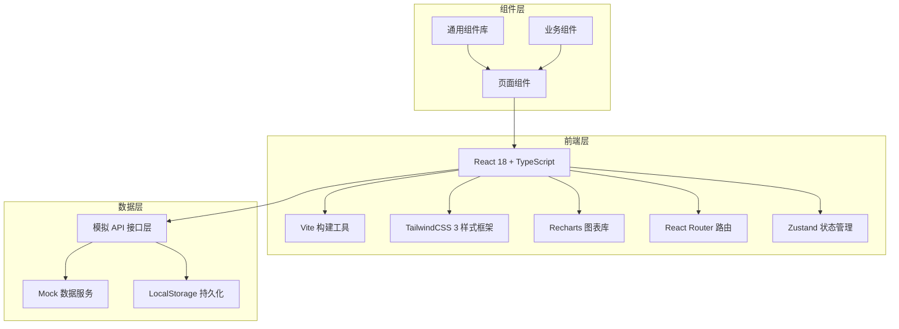
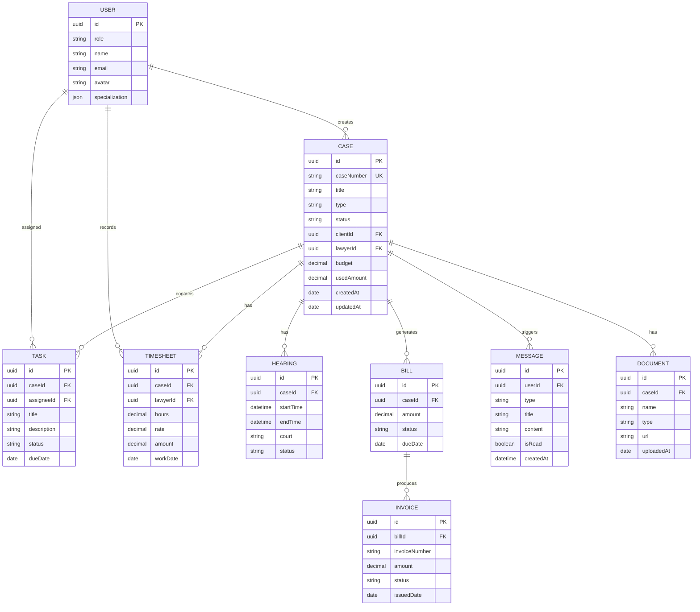

## 1. 架构设计



## 2. 技术描述

- **前端框架**: React@18 + TypeScript@5
- **构建工具**: Vite@5
- **样式框架**: TailwindCSS@3
- **路由管理**: React Router DOM@6
- **状态管理**: Zustand@4
- **图表库**: Recharts@2
- **图标库**: Lucide React
- **日期处理**: date-fns
- **数据模拟**: 内置 Mock 数据 + LocalStorage 持久化

## 3. 路由定义

| 路由路径 | 页面名称 | 适用角色 |
|----------|----------|----------|
| /login | 登录页 | 所有角色 |
| /client/dashboard | 客户工作台 | 客户 |
| /client/cases | 我的案件 | 客户 |
| /client/cases/new | 提交委托 | 客户 |
| /client/cases/:id | 案件详情 | 客户 |
| /client/bills | 账单中心 | 客户 |
| /client/invoices | 发票管理 | 客户 |
| /lawyer/dashboard | 律师工作台 | 律师 |
| /lawyer/cases | 案件管理 | 律师 |
| /lawyer/cases/:id | 案件详情 | 律师 |
| /lawyer/tasks | 任务管理 | 律师 |
| /lawyer/schedule | 日程排期 | 律师 |
| /lawyer/timesheet | 工时记录 | 律师 |
| /partner/dashboard | 合伙人仪表盘 | 合伙人 |
| /partner/analytics | 统计分析 | 合伙人 |
| /partner/cases | 案件总览 | 合伙人 |
| /arbitrator/dashboard | 仲裁员工作台 | 仲裁员 |
| /arbitrator/cases | 待审案件 | 仲裁员 |
| /arbitrator/cases/:id | 案件审理 | 仲裁员 |
| /finance/dashboard | 财务工作台 | 财务 |
| /finance/reports | 月度报表 | 财务 |
| /finance/invoices | 发票管理 | 财务 |
| /messages | 消息中心 | 所有角色 |
| /settings | 系统设置 | 所有角色 |

## 4. 数据模型

### 4.1 实体关系图



### 4.2 核心类型定义

```typescript
// 用户类型
type UserRole = 'client' | 'lawyer' | 'partner' | 'arbitrator' | 'finance';

interface User {
  id: string;
  role: UserRole;
  name: string;
  email: string;
  avatar: string;
  phone?: string;
  specialization?: string[];
  hourlyRate?: number;
}

// 案件类型
type CaseStatus = 'pending' | 'active' | 'hearing' | 'arbitration' | 'closed';
type CaseType = 'civil' | 'commercial' | 'criminal' | 'labor' | 'intellectual' | 'international';

interface Case {
  id: string;
  caseNumber: string;
  title: string;
  type: CaseType;
  status: CaseStatus;
  description: string;
  clientId: string;
  clientName: string;
  lawyerId: string;
  lawyerName: string;
  arbitratorId?: string;
  budget: number;
  usedAmount: number;
  conflictCheckPassed: boolean;
  createdAt: string;
  updatedAt: string;
  closedAt?: string;
}

// 任务类型
type TaskStatus = 'pending' | 'in_progress' | 'completed' | 'cancelled';

interface Task {
  id: string;
  caseId: string;
  caseName: string;
  assigneeId: string;
  assigneeName: string;
  title: string;
  description: string;
  status: TaskStatus;
  priority: 'low' | 'medium' | 'high';
  dueDate: string;
  createdAt: string;
}

// 工时记录
interface Timesheet {
  id: string;
  caseId: string;
  caseName: string;
  lawyerId: string;
  lawyerName: string;
  workDate: string;
  hours: number;
  rate: number;
  amount: number;
  description: string;
  createdAt: string;
}

// 庭审排期
interface Hearing {
  id: string;
  caseId: string;
  caseName: string;
  startTime: string;
  endTime: string;
  court: string;
  judge?: string;
  status: 'scheduled' | 'completed' | 'cancelled';
  notes?: string;
}

// 账单
interface Bill {
  id: string;
  caseId: string;
  caseName: string;
  clientId: string;
  amount: number;
  paidAmount: number;
  status: 'unpaid' | 'partial' | 'paid';
  dueDate: string;
  issuedDate: string;
  items: BillItem[];
}

interface BillItem {
  id: string;
  description: string;
  quantity: number;
  unitPrice: number;
  amount: number;
}

// 发票
interface Invoice {
  id: string;
  billId: string;
  invoiceNumber: string;
  amount: number;
  status: 'pending' | 'issued' | 'sent' | 'paid';
  type: 'vat' | 'normal';
  issuedDate: string;
  recipient: string;
  taxId?: string;
}

// 消息通知
type MessageType = 'case_assigned' | 'budget_warning' | 'hearing_scheduled' | 'decision_uploaded' | 'invoice_ready' | 'system';

interface Message {
  id: string;
  userId: string;
  type: MessageType;
  title: string;
  content: string;
  relatedId?: string;
  relatedType?: string;
  isRead: boolean;
  createdAt: string;
}

// 文档
interface Document {
  id: string;
  caseId: string;
  name: string;
  type: 'evidence' | 'pleading' | 'ruling' | 'contract' | 'other';
  size: number;
  uploadedBy: string;
  uploadedAt: string;
  url: string;
}
```

## 5. 项目结构

```
src/
├── assets/              # 静态资源
│   ├── fonts/
│   └── images/
├── components/          # 通用组件
│   ├── layout/         # 布局组件
│   ├── ui/             # 基础UI组件
│   └── shared/         # 业务通用组件
├── pages/              # 页面组件
│   ├── login/
│   ├── client/
│   ├── lawyer/
│   ├── partner/
│   ├── arbitrator/
│   ├── finance/
│   └── messages/
├── store/              # 状态管理
│   ├── useAuthStore.ts
│   ├── useCaseStore.ts
│   └── useMessageStore.ts
├── services/           # API服务层
│   ├── api.ts
│   ├── caseService.ts
│   ├── userService.ts
│   └── mockData.ts
├── types/              # 类型定义
│   └── index.ts
├── utils/              # 工具函数
│   ├── date.ts
│   ├── number.ts
│   └── caseNumber.ts
├── hooks/              # 自定义Hooks
│   ├── useAuth.ts
│   └── useNotification.ts
├── App.tsx
├── main.tsx
└── index.css
```
